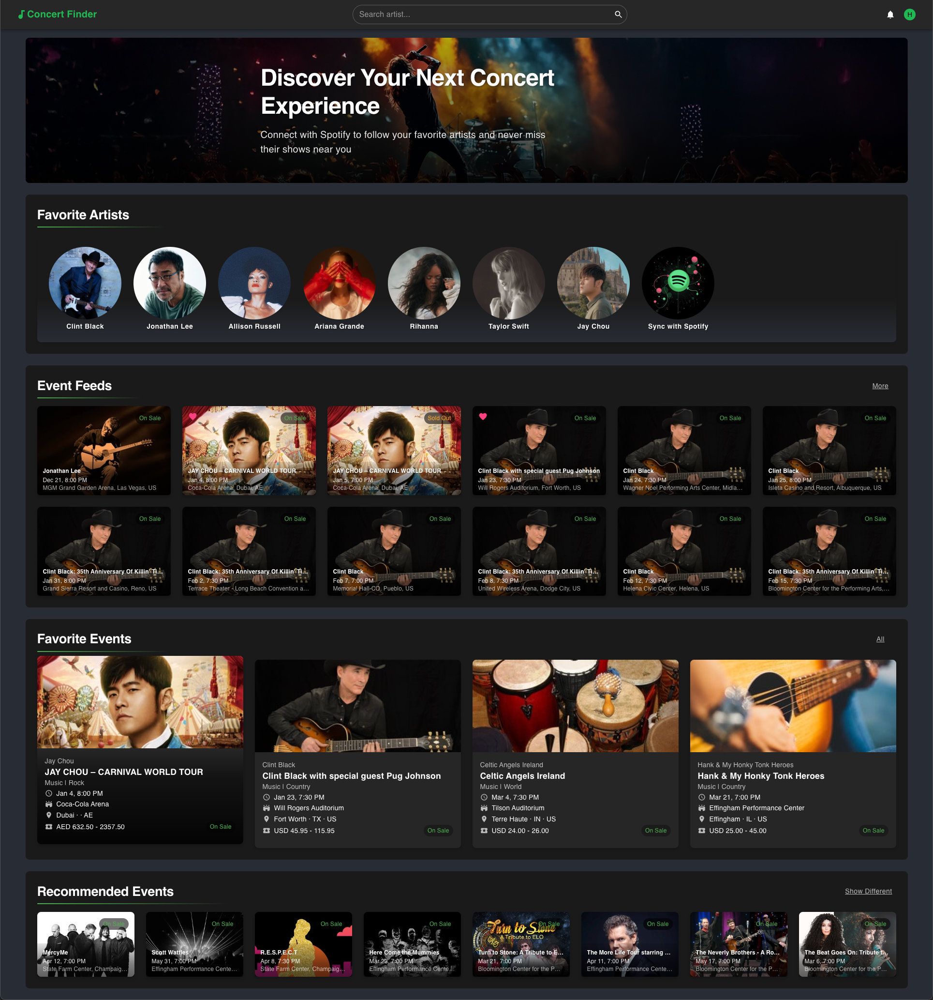

# Concert Finder

## Table of Contents

1. [Home Page Features](#1-home-page-features)
2. [User Features](#2-user-features)
3. [Concert Features](#3-concert-features)
4. [Artist Features](#4-artist-features)
5. [Search and Browse](#5-search-and-browse)
6. [Notification Features](#6-notification-features)
7. [Mobile Compatibility](#7-mobile-compatibility)

## 1. Home Page Features

### 1.1 For Non-logged-in Users:

- Latest concert information (Event Feeds)
- Current-location-based concert recommendations (Recommended Events)

### 1.2 For Logged-in Users:

- Latest concerts from followed artists (Event Feeds)
- List of followed artists (Favorite Artists)
- Saved concerts (Favorite Events)
- Location-based concert recommendations based on user preferences (Recommended Events)

## 2. User Features

### 2.1 New Account Registration

Register through either:

1. "Start Now" button in the homepage banner
2. "Sign In" button in the navigation bar, then click "Sign Up" link

Required information:

1. Required fields:
   - Email address
   - Password
   - Username
2. Optional fields:
   - ZIP code (default: 61820)
   - Search radius (default: 250 km)

### 2.2 Account Login

1. Click "Sign In" button in the top right corner
2. Enter email and password
3. Click "Sign In" button to log in

### 2.3 Profile Management

After logging in, click the profile picture in the top right corner to:

- Modify username
- Update password
- Set location ZIP code
- Adjust concert search radius
- Log out

## 3. Concert Features

### 3.1 View Concert Details

Click any concert card to view:

- Show time and location
- Ticket pricing
- Event status (On Sale/Sold Out/Cancelled etc.)
- Ticket purchase links
- Venue map location
- Distance to venue
- Additional concert information
- Special notes

### 3.2 Favorite Feature (Login Required)

Quickly favorite/unfavorite concerts from:

- Concert cards on the homepage
- Right side of concert cards in the concert list
- Action button area on concert detail pages

After favoriting:

- Heart icon turns solid pink
- Concert appears in "Favorite Events" section on homepage
- View all favorited concerts in "Favorite Events" page

### 3.3 Share Concerts

- Click "Share" button on concert detail page
- System automatically copies current page link to clipboard

## 4. Artist Features

### 4.1 Artist Detail Page

Click artist name or avatar to view:

- Artist photos and bio
- Social media links
- Upcoming concert list
- Concert favorite status and actions

### 4.2 Spotify Sync Feature

1. Log in using Spotify account
2. Click "Start Sync" button
3. Authorize access to your Spotify account
4. After sync, followed artists and their concerts will appear on homepage

## 5. Search and Browse

### 5.1 Search Artist Concerts

1. Enter search terms (e.g., artist name) in top navigation search bar
2. Press Enter or click search icon
3. System displays related concert information
4. If no results found, system provides search suggestions:
   - Check artist name spelling
   - Try alternative artist names
5. Search further by city or state, date range

### 5.2 Browse Concert Lists

Browse concerts through:

1. Homepage "More" buttons:

   - Event Feeds: View more recent concerts
   - Favorite Events: View all favorited concerts
   - Recommended Events: Click "Show Different" to refresh recommendations

2. Artist pages:
   - View all concerts for specific artists
   - Directly favorite interesting concerts
   - Follow artist updates through social media links

## 6. Notification Features

### 6.1 Email Notifications (Login Required)

1. Click bell icon in top right corner to enable/disable notifications
2. When enabled, receive:
   - New concert notifications for followed artists
   - Status updates for favorited concerts
   - Nearby new concert recommendations

### 6.2 In-app Notifications

- Success prompts (favorites, shares, etc.)
- System notifications (login status, sync status, etc.)
- Error messages (operation failed, login required, etc.)

## 7. Mobile Compatibility

- All features supported on mobile devices
- Interface automatically adjusts to screen size
- Touch operation optimization (swipe browsing, tap to favorite, etc.)
